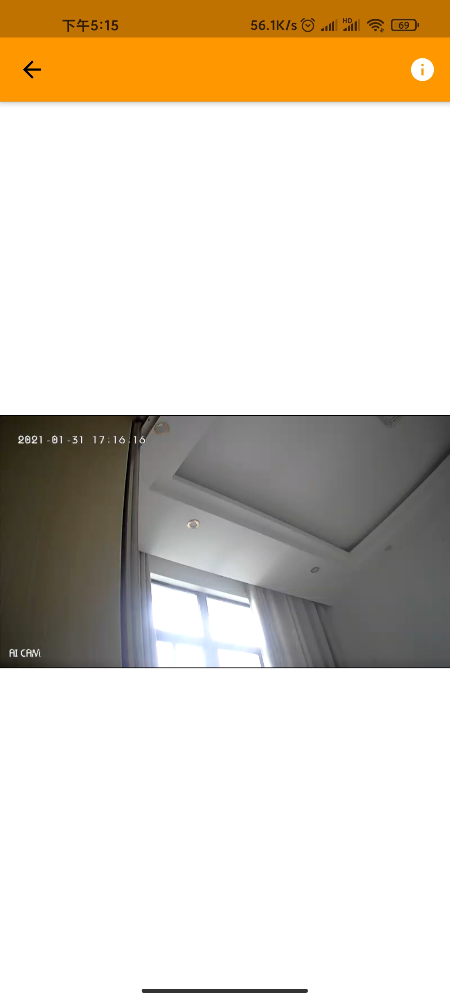
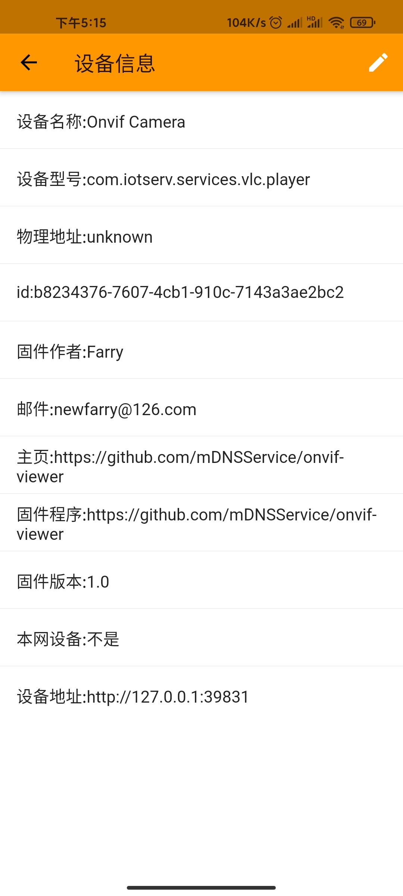

# onvif-viewer

[](https://snapcraft.io/onvif-viewer)

安装本插件，运行一遍插件生成配置文件，修改配置文件（修改添加onvif摄像头地址，用户名，密码），之后再运行一遍
然后使用云易连
View App: https://github.com/OpenIoTHub/OpenIoTHub
* deviceList.jpg

* cameraVideo.jpg

* deviceList.jpg

```sh
onvif-viewer -c /path/to/config/file/onvif-viewer.yaml
```
or just:
```
onvif-viewer
```
(use default config file: ./onvif-viewer.yaml)

You can install the pre-compiled binary (in several different ways),
use Docker.

Here are the steps for each of them:

## Install the pre-compiled binary

**homebrew tap** :

```sh
$ brew install OpenIoTHub/tap/onvif-viewer
```

**homebrew** (may not be the latest version):

```sh
$ brew install onvif-viewer
```

**snapcraft**:

```sh
$ sudo snap install onvif-viewer
```
config file path: /root/snap/onvif-viewer/current/onvif-viewer.yaml

edit config file then:
```sh
sudo snap restart onvif-viewer
```

**scoop**:

```sh
$ scoop bucket add OpenIoTHub https://github.com/OpenIoTHub/scoop-bucket.git
$ scoop install onvif-viewer
```

**deb/rpm**:

Download the `.deb` or `.rpm` from the [releases page][releases] and
install with `dpkg -i` and `rpm -i` respectively.

config file path: /etc/onvif-viewer/onvif-viewer.yaml

edit config file then:
```sh
sudo systemctl restart onvif-viewer
```

**Shell script**:

```sh
$ curl -sfL https://install.goreleaser.com/github.com/mDNSService/onvif-viewer.sh | sh
```

**manually**:

Download the pre-compiled binaries from the [releases page][releases] and
copy to the desired location.

Note that the image will almost always have the last stable Go version.

[releases]: https://github.com/mDNSService/onvif-viewer/releases

